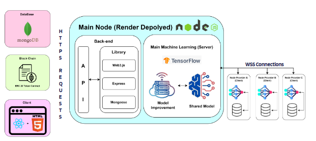

# DML-layer2-backend

With the rise of the blockchain industry, concerns regarding high energy consumption in Proof of Work (PoW) blockchains have become a hotly debated topic. Various algorithmic solutions have been suggested to address this issue, but they have often failed to maintain the competitive market nature of PoW, which is one of its key benefits. This project's main objective is to tackle high energy consumption by converting wasted energy into a resource for machine learning training. The project intended to develop a novel algorithm called Proof of Machine Learning (PoML), which operates alongside virtual machines. These servers serve as node providers, facilitating the distributed handling of machine-learning tasks. However, during the development of a novel consensus algorithm, the project soon realized construction of a novel algorithm could not be done within the time scope.  Hence, the project decided to develop a Decentralized Application (dApp) where motivation remains the same: solve high energy consumption problem by rewarding token to computational power.

<div align="center">
	
</div>

## Project setup
```
npm install
```
## Initialize
```
node index.js
```
## Configure environment file according to environment, e.g. .env 
```
#password for mongodb database
PASSWORD = ""
#wallet address for blockchain
MAINNODE = ""
#DML token contract address on Polygon Amoy test net
CONTRACT = "0xfd2289297D77Ce670f3D6764333fF95EEdaaD309"

EMAIL = ""
EMAIL_PASSWORD = ""
EMAIL_SMTP = ""
```

